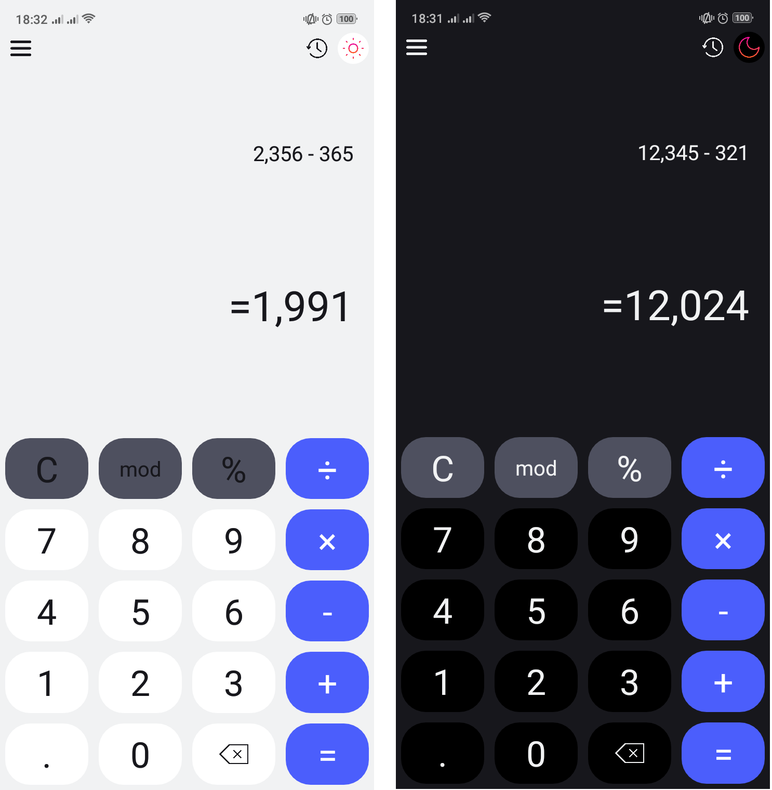

# CalcLT-Kotlin-Simple-Calculator

The Calculator app, developed in Kotlin, offers basic functions like addition, subtraction, multiplication, and division, along with a Dark Mode for easy viewing and reduced eye strain. Its user-friendly design makes calculations quick and efficient.

## Install

- `git clone https://github.com/thanh-ph2021/CalcLT-Kotlin-Simple-Calculator.git`
- `To open project in Android Studio -> Run`

